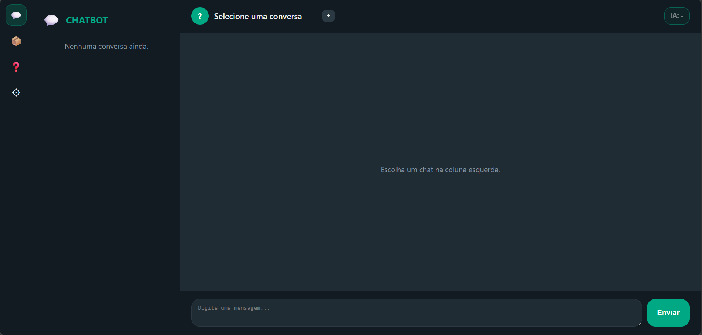
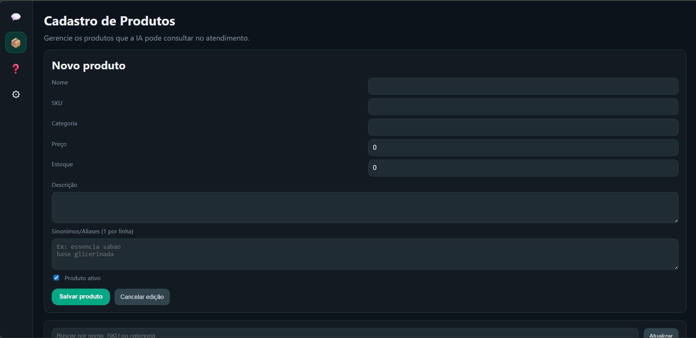
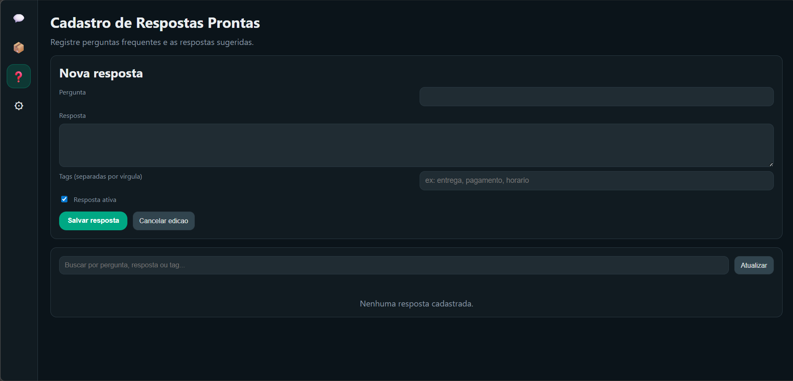
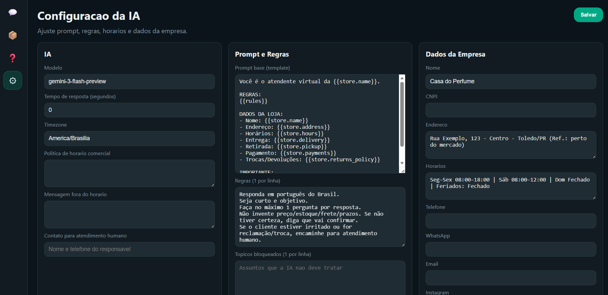

# Service for integration with LLM and chat applications

## 1. Description

This system was developed to automate customer service using artificial intelligence integrated with chat services.
The application allows configuring automatic responses, registering questions, defining response context, and controlling the behavior of the AI model.

The system works as an intermediary between the chat service and the AI API.

---

## 2. System Interface

### 2.1 Chats Screen

This screen displays the conversations received by the system.
Messages can be monitored and answered automatically according to the configured rules.

Functions:

* View messages
* Monitor conversations
* Identify users
* Send automatic responses

---

### 2.2 Product Registration (Test Implementation)

Screen used to register products.
Currently implemented only as a test structure for future integration with automatic responses.

Functions:

* Add product
* Edit product
* Remove product
* Associate product data with responses

---

### 2.3 Question Registration and Response Direction

This screen allows registering expected questions and defining the direction that the AI response should follow.

This helps control the behavior of the model and improve response accuracy.

Functions:

* Register question patterns
* Define expected context
* Define response direction
* Assist prompt construction

---

### 2.4 AI Settings

Screen responsible for configuring AI behavior.

Available settings:

* Main prompt
* Additional data
* AI model configuration
* Response delay
* Generation parameters

Default delay:
2 minutes

The delay is used to avoid instant responses and simulate a more natural interaction.

---

## 3. System Workflow

Basic flow:

1. The system receives a chat message
2. Registered questions are checked
3. The prompt is generated
4. The request is sent to the AI API
5. The configured delay is applied
6. The response is sent automatically

---

## 4. Technologies

* AI API
* Docker
* Backend service
* Database
* Web interface

---

## 5. Notes

This project is under development and is being used for study, testing, and academic purposes.
